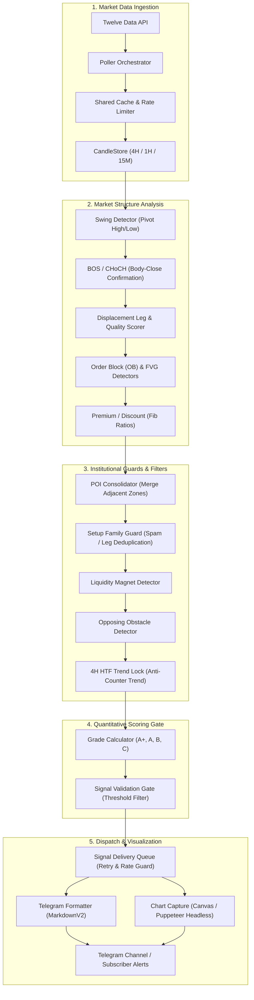

# ChecklistTrigger

<div align="center">

**Institutional Event-Driven Market Structure Analysis & Quantitative Alerting Engine**

[](https://github.com/Piardian/ChecklistTriger/actions/workflows/ci.yml)


[](./LICENSE)

</div>

---

## 📌 Executive Overview

**ChecklistTrigger** is a high-assurance, event-driven market structure analysis and alerting engine built with Node.js and TypeScript. Rather than functioning as a reactive indicator script, ChecklistTrigger operates as a multi-tier pipeline that ingests multi-timeframe candle data (4H, 1H, 15M), computes institutional Smart Money Concepts (SMC), executes structural validation gates, and dispatches high-probability candidate opportunities with visual chart overlays to Telegram.

The engine actively monitors high-liquidity Forex pairs (EUR/USD, GBP/USD, GBP/JPY, AUD/USD, USD/CAD) and indices (NAS100) using rate-limited API poller infrastructure.

---

## 🏛️ System Architecture



---

## ⚡ Core Methodologies & SMC Rules

1. **Multi-Timeframe Structural Alignment:**
   - **4H HTF Bias:** Defines primary market direction.
   - **1H Context:** Establishes intraday equilibrium and swing ranges.
   - **15M Execution:** Identifies precise entries, mitigating zones, and order blocks.
   - **4H Trend Lock:** Counter-trend entries (e.g. selling against a Bullish 4H structure) are rejected or severely penalized.

2. **Strict Structural Confirmations:**
   - **Wick vs. Body Close:** Candle wicks exceeding structural swings are classified as **Liquidity Sweeps**, not Breaks of Structure (BOS). Structural breaks require verified candle body closes with momentum.

3. **Displacement & Institutional Quality:**
   - Breakouts are validated via `DisplacementQualityScorer` (evaluating candle body ratio, expansion size, and consecutive directional impulse).

4. **POI Consolidation (`poiConsolidator.ts`):**
   - Automatically detects overlapping or proximate Order Blocks and Fair Value Gaps, consolidating them into unified, mathematically optimized POIs with safe Stop-Loss levels.

5. **Anti-Spam & Wave Deduplication (`setupFamilyGuard.ts`):**
   - Prevents duplicate alerts when multiple lower-timeframe formations emerge within the same impulse wave on the same asset.

6. **Liquidity Dynamics & Obstacle Detection:**
   - **Liquidity Magnets:** Evaluates unresolved equal highs/lows acting as target magnets.
   - **Opposing Obstacles:** Detects counter-trend supply/demand blocks sitting directly between entry and Target 1 (TP1).

---

## 📂 Repository Structure

```text
├── .github/
│   ├── workflows/ci.yml         # Automated GitHub Actions CI pipeline
│   ├── ISSUE_TEMPLATE/          # Bug report and feature request templates
│   └── PULL_REQUEST_TEMPLATE.md # Contribution verification checklist
│
├── server/                      # Runtime & Operational Services
│   ├── index.ts                 # Express startup & healthcheck endpoint
│   ├── poller.ts                # Multi-timeframe acquisition & orchestration
│   ├── pipeline.ts              # End-to-end signal generation pipeline
│   ├── candleStore.ts           # Time-series candle store & validation
│   ├── setupFamilyGuard.ts      # Impulse wave signal deduplicator
│   ├── signalDeliveryQueue.ts   # Resilient delivery queue with retry logic
│   ├── telegramFormatter.ts     # MarkdownV2 notification card builder
│   ├── chartRenderer.ts         # High-resolution Node-Canvas chart generator
│   └── tvChartCapture.ts        # Headless browser TradingView renderer
│
├── src/                         # Domain Logic & Analysis Engines
│   ├── swingDetector.ts         # High / Low pivot identification
│   ├── structureDetector.ts     # BOS & CHoCH state machine
│   ├── displacementLeg.ts       # Institutional momentum measurement
│   ├── obDetector.ts            # Order Block detection
│   ├── fvgDetector.ts           # Fair Value Gap detection
│   ├── poiConsolidator.ts       # POI boundary merger & optimizer
│   ├── opposingObstacleDetector.ts # Obstacle & friction analysis
│   ├── liquidityMagnetDetector.ts  # Target liquidity attraction analyzer
│   ├── gradeCalculator.ts       # Quantitative grading engine (A+ / A / B)
│   ├── signalValidationGate.ts  # Multi-criterion entry gate
│   ├── benchmarkEngine.ts       # Deterministic regression benchmark
│   └── historicalReplay.ts      # Multi-scenario dataset replay engine
│
├── docs/                        # Complete Technical Documentation
│   ├── README.md                # Documentation index & navigation
│   ├── SMC_JOURNAL.md           # Empirical trade reviews & post-mortem analysis
│   ├── audit/                   # Mathematical audits & precision checks
│   └── milestones/              # Historical architecture specifications
│
├── experiments/                 # Early Prototypes & Verification Scripts
│   └── python-prototype/       # Python mathematical models & CLI prototype
│
└── tests/                       # 80+ Jest Automated Test Suites
```

---

## 🚀 Getting Started

### Prerequisites
- **Node.js**: v20.x or v22.x LTS
- **npm**: v10+

### Installation
```bash
# Clone the repository
git clone https://github.com/Piardian/ChecklistTriger.git
cd ChecklistTriger

# Install dependencies
npm ci
```

### Environment Configuration
Copy `.env.example` to `.env` and fill in your API credentials:
```bash
cp .env.example .env
```

| Variable | Description | Default |
| :--- | :--- | :--- |
| `PORT` | Express server port for health checks | `3000` |
| `TWELVE_DATA_API_KEY` | API Key from Twelve Data | Required |
| `TELEGRAM_BOT_TOKEN` | Telegram Bot Token from BotFather | Required |
| `TELEGRAM_CHAT_ID` | Telegram Channel or User ID for alerts | Required |
| `REQUIRE_TELEGRAM_READINESS`| Fails startup if Telegram is unreachable | `false` |
| `TWELVE_DATA_CREDITS_PER_MINUTE` | Rate limit ceiling per minute | `8` |
| `ENABLE_KILLZONE` | Filters signals to active market sessions | `true` |

---

## 🛠️ Available Scripts

```bash
# Run all automated tests (80+ suites)
npm test

# Run tests with unit alias
npm run test:unit

# Typecheck TypeScript codebase with zero emissions
npm run typecheck

# Build production distribution
npm run build

# Start production server
npm start

# Interactive visualization preview
npm run demo:preview
```

---

## 📊 Operational Telemetry & Health Checks

When running in production, ChecklistTrigger exposes a lightweight JSON health endpoint:

```bash
curl http://localhost:3000/health
```

**Response:**
```json
{
  "status": "healthy",
  "uptimeSeconds": 14230,
  "queueDepth": 0,
  "lastPoll": "2026-09-11T18:15:00.000Z",
  "symbolsTracked": ["EURUSD", "GBPUSD", "GBPJPY", "AUDUSD", "USDCAD", "NAS100"]
}
```

---

## 📖 In-Depth Documentation

For detailed architectural contracts, benchmark foundations, and the empirical trade review log:
- 📑 **[Documentation Index & Specifications](./docs/README.md)**
- 📓 **[SMC Observational Trade Journal](./docs/SMC_JOURNAL.md)**
- 📐 **[Mathematical Audit Report](./docs/audit/SMC_MATHEMATICAL_AUDIT_REPORT.md)**

---

## ⚖️ Disclaimer & Limitations

ChecklistTrigger is an engineering framework designed for deterministic market structure modeling and event-driven alerting.
- Analysis outputs and signal scores represent mathematical rule evaluations, **not financial advice or profit guarantees**.
- Market data is subject to upstream provider latency and availability.
- Past algorithmic backtest metrics do not guarantee live market outcomes.

---

## 📄 License

Distributed under the **MIT License**. See [`LICENSE`](./LICENSE) for more information.


## Historical Research Data

Historical replay uses canonical OHLC JSON files in `data/`:

```text
data/EURUSD_15m.json
data/EURUSD_1h.json
data/EURUSD_4h.json
```

Download a bounded historical window from the existing Twelve Data provider:

```bash
npm run data:download -- --symbol EURUSD --months 6
```

Or specify an explicit UTC range:

```bash
npm run data:download -- --symbol EURUSD --start 2026-03-01T00:00:00Z --end 2026-09-01T00:00:00Z
```

Validate the generated datasets before replay:

```bash
REPLAY_SYMBOLS=EURUSD npm run data:validate
```

The downloader requests bounded `start_date`/`end_date` windows and keeps each request below Twelve Data's documented 5,000-point maximum. The generated data is local research input and remains ignored by Git.

